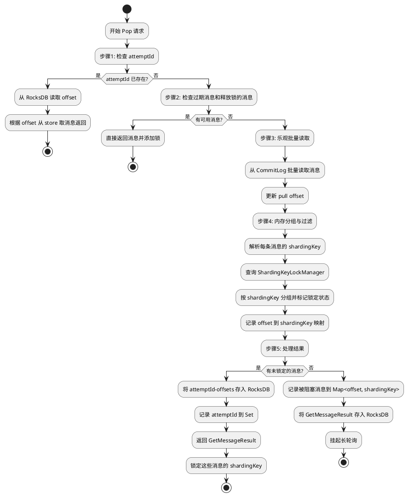

# pop 顺序消费的并发
## 背景
pop 消费模式允许了一个 queue 被多个消费者同时进行消费，提高了单个 queue 的并发度，非常的 nice。

然而顺序消费在单个 queue 上依旧是被阻塞住的，只有等到前面的消息超时或者被 ack 之后，才能继续消费下一批消息，即使前面消息的 sharding key 与即将要消费的消息的 sharding key 完全不同，这种情况下顺序消费没有任何问题，其他的消费者也都被阻塞，没有任何并发度。例如是下面这种情况：

```plain
wait for ack   
     |        
     v         
 +---+--------+
 | A | BCDEFG |
 +---+--------+
```

现在有 sharding key 为 A 的消息已被拉取但是没有被 ack，这会导致后续的所有消息都被阻塞无法消费。也就是说，只要有在不可见期内的未确认消息，那么后续消息都无法被消费。这就大大限制了顺序消息的消费能力。


## 先前的的 pop 消费顺序消息的方案
先前pop消费顺序消息是**基于单个队列（Queue）的严格串行化锁定机制**。

### 1. Pop流程 (拉取消息)
当一个消费者发起顺序消息的Pop请求时（`order=true`），其处理流程如下：

1. **入口**：`PopMessageProcessor.processRequest()` -> `popMsgFromQueue()` (旧版) 或 `PopConsumerService.popAsync()` (新版KV模式)。
2. **核心阻塞检查**：在真正从`MessageStore`拉取消息之前，会调用 `ConsumerOrderInfoManager.checkBlock()` 方法。这是实现顺序性的关键。
3. `ConsumerOrderInfoManager.checkBlock()` 逻辑
    - 它会根据 `topic@group` 和 `queueId` 查找是否存在一个 `OrderInfo` 对象。
    - `OrderInfo` 对象代表**上一次**从这个队列中Pop出去但**尚未被完全确认**的一批消息。
    - 如果 `OrderInfo` 存在，说明队列中有“飞行中”的消息，此时需要判断是否阻塞后续的Pop请求。
    - **阻塞条件**：`OrderInfo.needBlock()` 方法判断，如果这批未确认的消息还在其 `invisibleTime` (不可见时间) 内，则返回 `true`，表示**阻塞**，本次Pop请求失败，不会去拉取新消息。
    - **例外**：如果本次Pop请求的 `attemptId` 和 `OrderInfo` 中记录的 `attemptId` 相同，则不阻塞。这是为了处理客户端对同一次Pop操作的重试。
4. 拉取与状态更新：
    - 如果 `checkBlock()` 返回 `false` (不阻塞)，Broker会从`MessageStore`拉取一批新消息。
    - 成功拉取后，调用 `ConsumerOrderInfoManager.update()` 方法。
    - `update()` 方法会创建一个**新的 **`OrderInfo`** 对象**，记录下这批新消息的 `popTime`、`invisibleTime`、`attemptId` 以及所有消息的偏移量列表 (`offsetList`)。这个新的 `OrderInfo` 会替换掉旧的，并成为下一次 `checkBlock()` 的依据。

Pop的顺序性是通过 `ConsumerOrderInfoManager` 中为每个 `topic@group:queueId` 维护一个 `OrderInfo` 状态对象实现的。只要这个状态对象存在且未超时，就意味着队列被“锁定”，任何其他Pop请求都会被阻塞，从而保证了整个队列的消费是串行的。


### 2. ACK流程 (确认消息)
当消费者处理完消息，发送ACK请求时，流程如下：

1. **入口**：`AckMessageProcessor.processRequest()`。它会识别出这是一个顺序消息的ACK（通过 `reviveQid == POP_ORDER_REVIVE_QUEUE`）。
2. **核心确认逻辑**：调用 `ackOrderly()` (旧版) 或 `ackOrderlyNew()` (新版)，最终都委托给 `ConsumerOrderInfoManager.commitAndNext()`。
3. `ConsumerOrderInfoManager.commitAndNext()` 逻辑:
    - 找到对应的 `OrderInfo` 对象。
    - 验证ACK请求的 `popTime` 是否与 `OrderInfo` 中记录的一致，防止过期的ACK请求扰乱状态。
    - 在 `offsetList` 中找到 `ackOffset` 对应的位置（索引 `i`）。
    - 使用位图 `commitOffsetBit`，将第 `i` 位置为1，表示该消息已确认。例如 `commitOffsetBit |= (1L << i)`。
    - 调用 `OrderInfo.getNextOffset()` 计算下一个**可以提交的消费位点**。
4. `OrderInfo.getNextOffset()` 逻辑:
    - 它会从 `commitOffsetBit` 的第0位开始遍历。
    - 找到第一个为0的位（即第一个未被ACK的消息）。
    - 返回这个未被ACK消息的偏移量。
    - 如果所有位都为1（所有消息都已ACK），则返回这批消息中**最后一个消息的偏移量+1**。
5. **提交消费位点**：`AckMessageProcessor` 拿到 `getNextOffset()` 返回的位点后，更新 `ConsumerOffsetManager` 中的消费进度。这意味着，只有当一批消息中从头开始连续的部分被ACK后，消费进度才会向前推进。
6. **解锁与唤醒**：当一个ACK使得消费进度向前推进后，`ackOrderly` 方法会调用 `notifyMessageArriving()`，唤醒其他等待在这个队列上的长轮询请求，使其可以尝试下一次Pop。当 `OrderInfo` 中的消息全部被ACK后，下一次Pop时 `checkBlock` 就会返回`false`，从而拉取新的一批消息。


### 3. 核心问题总结
当前机制的本质是**队列级锁 (Queue-Level Lock)**。

+ **优点**：实现简单、可靠，能100%保证单个队列内的消息被严格按存储顺序消费。
+ **缺点**：**性能瓶颈**。只要Pop出的一批消息中有一个处理得慢，就会导致整个队列被阻塞。即使这批消息包含多个不同业务（不同Sharding Key）的消息，它们也必须相互等待，无法并发，极大地限制了消费吞吐量。


## 前置知识
+ 消息的 sharding key 需要从 store 层读出 commit log 才能知道
+ 从 store 层中读到的消息，目前需要 decode 才能得到 sharding key
+ 读消息在前，知道 sharding key 在后
+ 当前已有一个 cache 用于确认消息是否被 ack——PopConsumerCache
+ 写缓存是在获取完消息之后，写入的 PopConsumerContext.getPopConsumerRecordList()
+ PopConsumerContext 中有 GetMessageResult 和 PopConsumerRecord
    - GetMessageResult 比较大，是具体的消息内容
    - PopConsumerRecord 比较小，是存在缓存和 rocksdb 中记录消费位点的。消息投递时创建记录 → 缓存/持久化存储 →  超时扫描重新投递 → 消息确认时删除记录
+ Pop 顺序消费提交位点是在 ack 才提交位点：PopConsumerService.java#L409
+ Pop 普通消息从 broker 给出去就提交位点。
+ OrderInfo 中的 offsetList 记录了一批消息的 offset，commitOffsetBit 则记录了这一批消息有没有被 ack。
+ queue pop 的时候 getMessageAsync 的时候是不区分顺序消息和普通消息的，因为如果顺序消息不被 block 那么说明前面的消息都被 ack 了。
+ Pop 消息从 broker 拉取数据之后会在 handleGetMessageResult 中调用 update 方法更新消息列表的接收状态，这里可以获取到分发给客户端的消息。
+ GetMessageResult 中的 SelectMappedBufferResult 和 ByteBuffer 都包含了消息，SelectMappedBufferResult 是对 ByteBuffer 的再次包装，为了便于对 ByteBuffer 进行操作，封装了一些方法。而 ByteBuffer 则是对 commitlog 的引用。这里的 ByteBuffer 使得 commitlog 的引用计数增加了，防止 commitlog 在内存中被清除掉。
+ 如果一批消息 sharding key 过期之后，不能直接回退 pull offset 位点，直接会退位点会导致重复消费很多很多消息，例如：

```plain
+-----------------+---+---------------------------+      
|committed message|AAA|BBB CCC DDD EEE FFF GGG HHH|      
+-----------------+---+---------------------------+      
                  ^                               ^
                  |                               |
              expire offset                   pull offset
```

这里的 AAA 过期了，但是 pull offset 可能已经向后走了很多了，不能直接调 offset 让 AAA 可消费，这样就有太多消息被重复了。所以这里还需要设置一个重试的 cache 放入这些过期的消息以便能够被重新消费。原先的设计是没有这个问题的，因为即使 sharding key 不同也会阻塞，pull offset 和过期消息的 offset 不会差很多。

+ attemptId 相同的请求就是返回原先的数据

## 方案设计
### 乐观读取 + 多 shardingKey 并发
#### 设计思路
将基于队列和基于 sharding key 的 pop 读取和 ack 确认的共同的内容抽象成一个接口之后，发现逻辑没有想象中那么复杂，主要包括了这些逻辑：

+ 什么时候阻塞队列（checkBlock）
+ 取到数据之后更新顺序消费锁的状态（update）
+ 客户端 ack 消息之后更新锁的状态（commitAndNext）
+ 客户端更新锁的过期时间（updateNextVisibleTime）
+ 重置消费位点之后的清除锁状态（clearBlock）
+ 消息不可见时间的过期（timer wheel）

总结一下，其实主要就是围绕了锁来展开，保证锁在各种情况下的正确表现即可，queue 级别和 sharding key 级别的锁最大的不同点其实就在于 **queue 级别阻塞是先判断是否阻塞，再读取数据**。而 **sharding key 级别是先读取数据，再判断是否阻塞。**

这是因为`sharding key` 存在于 `CommitLog` 的消息属性（Properties）中，必须完整读取消息体才能解析。所以「先检查锁，再拉取消息」的原始范式变得不可行，因为这里有一个前提：**为了知道** `sharding key`**，我们必须至少进行一次磁盘 I/O 来读取消息内容**。

那么，如果有这个无法绕开的物理读取，策略和目标应当转变为：

1. **最小化无效读取的代价**。
2. **避免在发现读取无效后，陷入“忙等”式的CPU和磁盘消耗**。
3. **从无效的读取中榨取未来可用的信息**。

基于这个思路，pop 消费应当先读取，后分发，并在没有消息的时候挂起长轮询，ack 释放 sharding key 的时候唤醒长轮询。具体流程为：

#### pop 消费步骤


##### 步骤 1：检查 attemptId
要点：

+ 相同 attemptId 返回相同的消息
+ GetMessageResult 较大，不适合在内存中长期存储

这里内存中记录一个 Set<attemptId>，当用户的 attemptId 命中时，再去 rocksdb 中读取完整的 offset，并根据 offset 从 store 中取消息并返回。

##### 步骤 2：检查是否有已过期消息和来自 ack 被释放的可用的消息
已过期的消息和因为 ack 被释放锁的消息可以直接给出去，不用再次检查 shardingKey 锁，给出去的时候添加锁。

##### 步骤 3：乐观批量读取
+ 先从被释放锁的 cache 中读取消息，这一部分消息能够直接被消费，因为他们是过期消息。
+ 从当前消费队列的起始消费位点开始，**连续地、一次性地**从 `CommitLog` 中读取一批消息。
+ 这是一个不可避免的 I/O 消耗，批量读取通常比多次单条读取要高效。
+ 更新 pull offset

##### 步骤 4：内存分组与过滤
+ 将这批读取到的消息加载到内存中。
+ 遍历这批消息，对每一条消息：
    - 解析出其 `sharding key`通过（org.apache.rocketmq.common.message.MessageDecoder#decodeProperties）。
    - 查询 `ShardingKeyLockManager`，判断该 `sharding key` **当前是否被锁定**。
    - 将消息按 `sharding key` 分组，并标记其锁定状态。
    - 并记录这批消息 offset （org.apache.rocketmq.store.GetMessageResult#messageQueueOffset）到 sharding key 的映射，用于 ack 的时候释放锁。

##### 步骤 5：处理结果并返回
+ 从分组后的消息中，挑选出所有**未被锁定**的 `sharding key` 对应的消息。
+ 如果找到了至少一条可用消息：
    - 记录 attemptId 到 Set<attemptId>，并将 attemptId 对应的 offsets 记录到 rocksdb。
    - 将这些消息返回给消费者（需要返回的是 GetMessageResult）。
    - 立即锁定这些消息的 `sharding key`，更新`ShardingKeyLockManager`
        * 用一个 Map<topic@group@queue@shardingKey, shardingKeyLock> 来记录
    - 更新 pull offset 为给出去这批消息的最小值
    - 流程成功结束。
+ **如果遍历完整个批次，发现所有消息的 **`sharding key`** 都已被锁定**，导致一条可用消息都找不到。这个时候，可以将这些 **被阻塞住的消息的 offset 以及对应的 sharding key** 给记录下来，存入一个内存的 Map<offset, shardingKey>，这样可以减少一次 decode 的消耗。并且挂起长轮询。同时把这批被阻塞 shardingKey 对应的 GetMessageResult 记录在 rocksdb 中，key 为 topic@group@queue@shardingKey，用于后续消费。

#### ack 确认步骤

##### 步骤 1：检查 popTime
##### 步骤 2：根据 offset 查找 shardingKey 并释放锁
找到 shardingKey 之后，得到对应的 shardingKeyLock，在其中删除掉 offset，当 shardingKeyLock 中的 offset 都被删干净之后，就释放 shardingKey 级别的锁。

##### 步骤 3：更新消费组的消费位点
##### 步骤 4：根据 shardingKey 从 rocksdb 中检索出可用的消息放入 cache
如果 shardingKey 锁因为 ack 被释放了，这样就可以释放一批之前乐观读取到的一批消息，这些消息就能够直接被新的 pop 请求给拉走。

##### 步骤 4：唤醒长轮询，重新执行 popProcessor.processRequest
#### 定时任务1: 锁过期定时清理
要点：

+ 存储超时消息的一个 cache
+ 长轮询唤醒

对于锁的自动过期和落盘以及定时清理其实都是围绕 Map<topic@group@queue@shardingKey, shardingKeyLock> 这个 map 来展开的。这个 map 作为 cache 存储了 shardingKey 级别的锁，每个锁中记录了过期时间，锁状态等信息，于是可以实现针对于 sharding key 的阻塞（pop 消费）、sharding key 锁的释放（ack）、不可见时间的续期（update InvisibleTime）。

当 update 分发消息的时候，在时间轮中创建对应过期时间的一个定时任务，并且在 `<font style="color:rgb(51, 51, 51);background-color:rgb(243, 244, 244);">Map<topic@group@queue@shardingKey, Timeout>` 中记录这个任务，允许客户端对过期时间进行修改，当修改过期时间时，创建新的定时任务，并取消掉原先的定时任务。

当锁过期的时候是以下步骤：

+ 将过期的消息恢复到一个 cache 中允许读取，而不是直接重置位点位置
+ 释放过期消息的锁，确保在 update 方法中不被过滤掉

#### 数据结构
1. shardingKey map 的锁的 map

```java
ConcurrentHashMap<String/* topic@group */,
ConcurrentHashMap<Integer /* queueId */,
ConcurrentHashMap<Long/* shardingkey */, ShardingKeyLock/* lock */>>> shardingKeyLockMap =
new ConcurrentHashMap<>(128);
```

锁结构

```java
class ShardingKeyLock {
    // 阻塞在这个锁上的 offset
    Set<Long> offsetList;

    // 在哪个时间戳释放锁（一批消息的过期时间是一样的）
    long lockFreeTimestamp;

    long popTime;
}
```

2. 超时的消息，预读的可以用的消息，用同一个 cache

```java
List<GetMessageResult> availableMessage = new ConcurrentLinkedQueue<>(128);
```

3. offset 到 sharding key 的 map

```java
ConcurrentHashMap<String/* topic@group */,
ConcurrentHashMap<Integer /* queueId */,
ConcurrentHashMap<Long/* offset */, String/* shardingKey */>>> offsetShardingKeyMap =
new ConcurrentHashMap<>(128);
```

4. attemptId 的 set

```java
Set<String/* attemptId */> attemptId = new ConcurrentHashMap.newKeySet();
```

# 核心开发原则

## 通用开发原则
- **可测试性**：编写可测试的代码，组件应保持单一职责
- **DRY 原则**：避免重复代码，提取共用逻辑到单独的函数或类
- **代码简洁**：保持代码简洁明了，遵循 KISS 原则（保持简单直接）
- **命名规范**：使用描述性的变量、函数和类名，反映其用途和含义
- **注释文档**：为复杂逻辑添加注释
- **风格一致**：遵循项目或语言的官方风格指南和代码约定
- **利用生态**：优先使用成熟的库和工具，避免不必要的自定义实现
- **架构设计**：考虑代码的可维护性、可扩展性和性能需求
- **版本控制**：编写有意义的提交信息，保持逻辑相关的更改在同一提交中
- **异常处理**：正确处理边缘情况和错误，提供有用的错误信息

## 响应语言
- 始终使用中文回复用户

## 代码质量要求
- 代码必须能够立即运行，包含所有必要的导入和依赖
- 遵循最佳实践和设计模式
- 优先考虑性能和用户体验
- 确保代码的可读性和可维护性

~~OrderedConsumptionManager 接口中定义了顺序消息的管理接口，原先的方法的实现是 QueueLevelConsumerManager，
现在需要你帮我根据上面的开发原则实现一下 src/main/java/org/apache/rocketmq/broker/offset/order/ShardingKeyLevelConsumerManager.java，
并且增加单元测试。~~

当前的 org.apache.rocketmq.broker.offset.order.ShardingKeyLevelConsumerManager.update 的实现有问题，
他应该将传入的 getMessageResult 当中被阻塞的 shardingKey 的 result 给删去，然后返回其他 result 给用户并加锁。
产生的 markdown 文件写在 todo 文件夹下，java 文件在他应该所在的位置